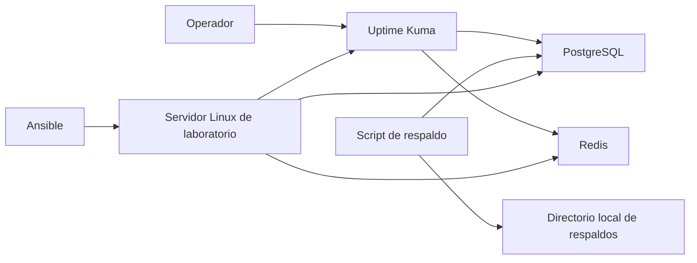

# Infra Operations Lab

Laboratorio personal y reproducible para practicar operación de servicios: despliegue con contenedores, disponibilidad básica, respaldo, recuperación y automatización.

> Este repositorio no representa infraestructura de ningún empleador ni contiene configuraciones, datos, credenciales o direcciones reales. Es una muestra técnica creada para fines de aprendizaje y portafolio.

## Qué demuestra

- Despliegue de servicios de estado con Docker Compose.
- Separación de configuración mediante variables de entorno.
- Monitoreo de disponibilidad con Uptime Kuma.
- Proceso documentado de respaldo y prueba de recuperación de PostgreSQL.
- Automatización inicial con Bash y Ansible.

## Arquitectura

## Inicio rápido

1. Copia `.env.example` como `.env` y define valores locales.
2. Ejecuta `docker compose up -d`.
3. Abre `http://localhost:3001` y configura las comprobaciones de PostgreSQL y Redis.
4. Ejecuta el respaldo con `bash scripts/backup-postgres.sh`.
5. Sigue [la prueba de recuperación](docs/recovery-test.md) antes de considerar útil un respaldo.

## Estructura

- `docker-compose.yml`: servicios del laboratorio.
- `scripts/backup-postgres.sh`: ejemplo de exportación lógica de PostgreSQL.
- `ansible/playbooks/bootstrap-linux.yml`: preparación mínima y repetible de un host Linux.
- `docs/recovery-test.md`: procedimiento seguro de validación de restauración.

## Límites deliberados

Este laboratorio es local. No pretende ser una plantilla de producción ni sustituye diseño de alta disponibilidad, gestión centralizada de secretos, endurecimiento específico, observabilidad empresarial o copias externas.

